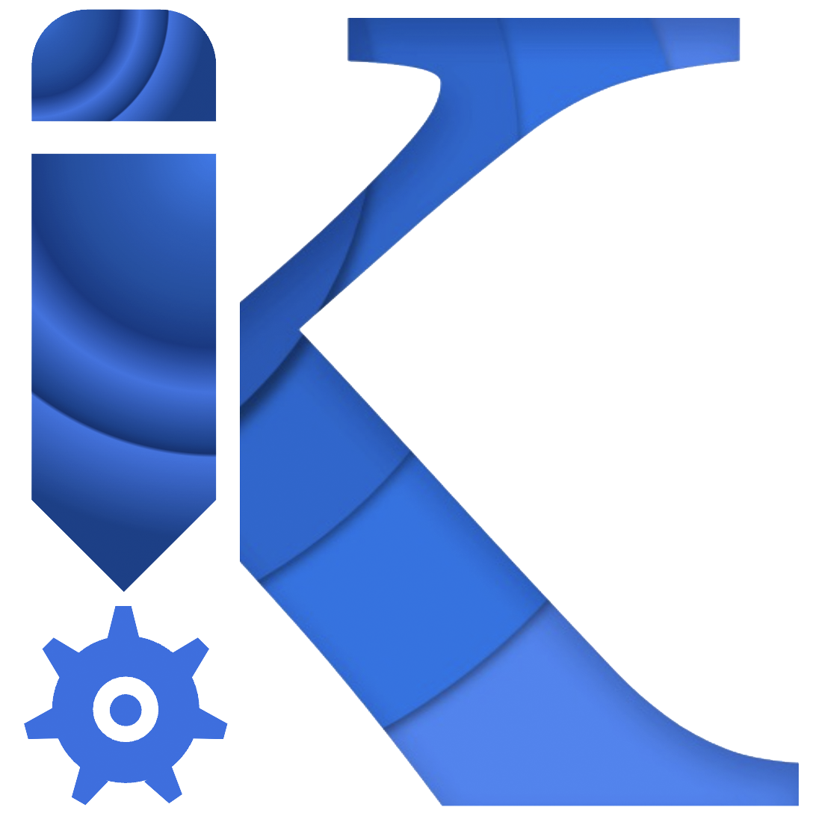

# kpt: Automate Kubernetes Configuration Editing

kpt is a package-centric toolchain that enables a WYSIWYG configuration 
authoring, automation, and delivery experience, which simplifies managing
Kubernetes platforms and KRM-driven infrastructure (e.g.,
[Config Connector](https://github.com/GoogleCloudPlatform/k8s-config-connector),
[Crossplane](https://crossplane.io)) at scale by manipulating
declarative [Configuration as Data](docs/design-docs/06-config-as-data.md).

*Configuration as Data* is an approach to management of configuration which:

* makes configuration data the source of truth, stored separately from the live
  state
* uses a uniform, serializable data model to represent configuration
* separates code that acts on the configuration from the data and from packages
  / bundles of the data
* abstracts configuration file structure and storage from operations that act
  upon the configuration data; clients manipulating configuration data don’t
  need to directly interact with storage (git, container images).

See [the FAQ](https://kpt.dev/faq/) for more details about how kpt is different
from alternatives.

## Why kpt?

kpt enables WYSIWYG editing and interoperable automation applied to declarative
configuration data, similar to how the live state can be modified with imperative
tools. 

See [the rationale](https://kpt.dev/guides/rationale) for more background.

The best place to get started and learn about specific features of kpt is 
to visit the [kpt website](https://kpt.dev/).

## Install kpt

kpt installation instructions can be found on 
[kpt.dev/installation](https://kpt.dev/installation/)

## kpt components

The kpt toolchain includes the following components:

- **kpt CLI**: The [kpt CLI](https://kpt.dev/reference/cli/) supports package and function operations, and also
  deployment, via either direct apply or GitOps. By keeping an inventory of deployed resources, kpt enables resource pruning,
  aggregated status and observability, and an improved preview experience.

- **Function SDKs**: Any general-purpose or domain-specific language can be used to create functions to transform and/or validate
  the YAML KRM input/output format, but we provide SDKs to simplify the function authoring process, in 
  [Go](https://kpt.dev/book/05-developing-functions/02-developing-in-Go), 
  [Typescript](https://kpt.dev/book/05-developing-functions/03-developing-in-Typescript), and 
  [Starlark](https://kpt.dev/book/05-developing-functions/04-developing-in-Starlark), a Python-like embedded language.

- **Function catalog**: A [catalog](https://catalog.kpt.dev/) of off-the-shelf, tested functions. kpt makes configuration
  easy to create and transform, via reusable functions. Because they are expected to be used for in-place transformation,
  the functions need to be idempotent.

- **Package orchestrator**: 
  The [package orchestrator](https://github.com/GoogleContainerTools/kpt/blob/main/docs/design-docs/07-package-orchestration.md)
  enables the magic behind the unique WYSIWYG experience. It provides a control plane for creating,
  modifying, updating, and deleting packages, and evaluating functions on package data. This enables operations on packaged resources
  similar to operations directly on the live state through the Kubernetes API.

- **Config Sync**: While the package orchestrator
  can be used with any GitOps tool, [Config Sync](https://github.com/GoogleContainerTools/kpt-config-sync) provides a reference GitOps implementation to complete the WYSIWYG management
  experience and enable end-to-end development of new features, such as 
  [OCI-based packages](https://github.com/GoogleContainerTools/kpt/issues/2300). Config Sync is also helping to drive improvements
  in upstream Kubernetes. For instance, Config Sync is built on top of [git-sync](https://github.com/kubernetes/git-sync) and
  leverages [Kustomize](https://kustomize.io) to automatically render manifests on the fly when needed. It uses the same apply
  logic as the kpt CLI.

- **Backstage UI plugin**: We've created a proof-of-concept UI in the form of a [Backstage UI plugin](https://github.com/GoogleContainerTools/kpt-backstage-plugins) to demonstrate the WYSIWYG experience that's possible on top of the
  package orchestrator. More scenarios can be supported by implementing form-based editors for additional Kubernetes resource types.

## Roadmap

You can read about the big upcoming features in the 
[roadmap doc](/docs/ROADMAP.md).

## Contributing

If you are interested in contributing please start with 
[contribution guidelines](CONTRIBUTING.md).

## Contact

We would love to keep in touch:

1. Join our [Slack channel](https://kubernetes.slack.com/channels/kpt). You'll
   need to join [Kubernetes on Slack](https://slack.k8s.io/) first.
1. Join our [email list](https://groups.google.com/forum/?oldui=1#!forum/kpt-users)
