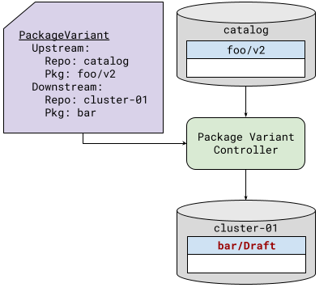
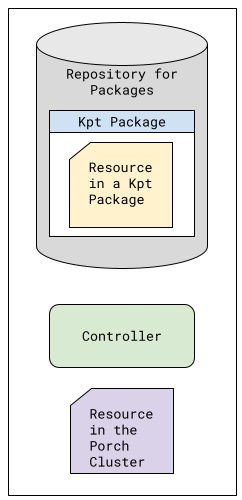
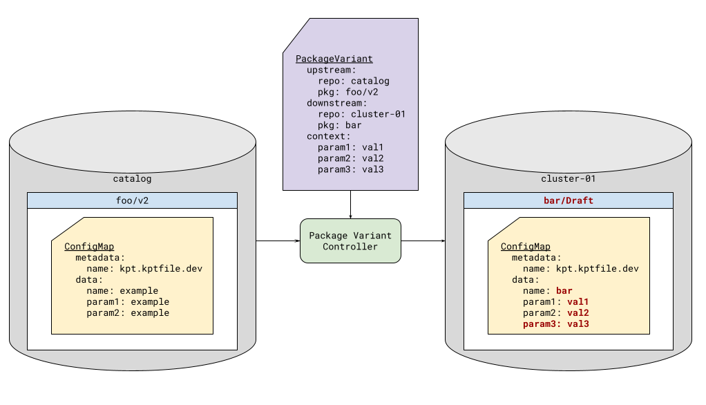
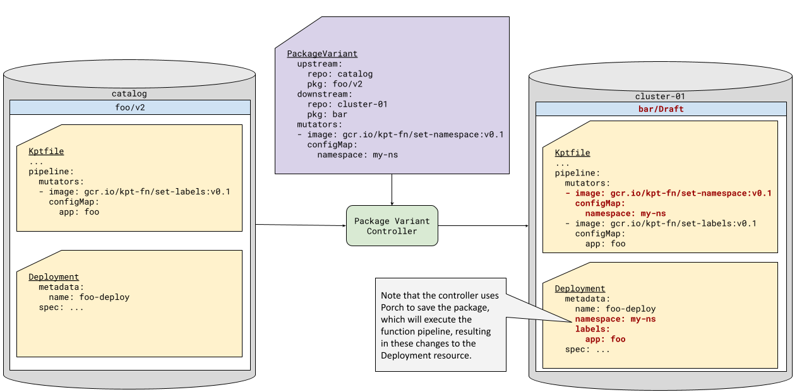
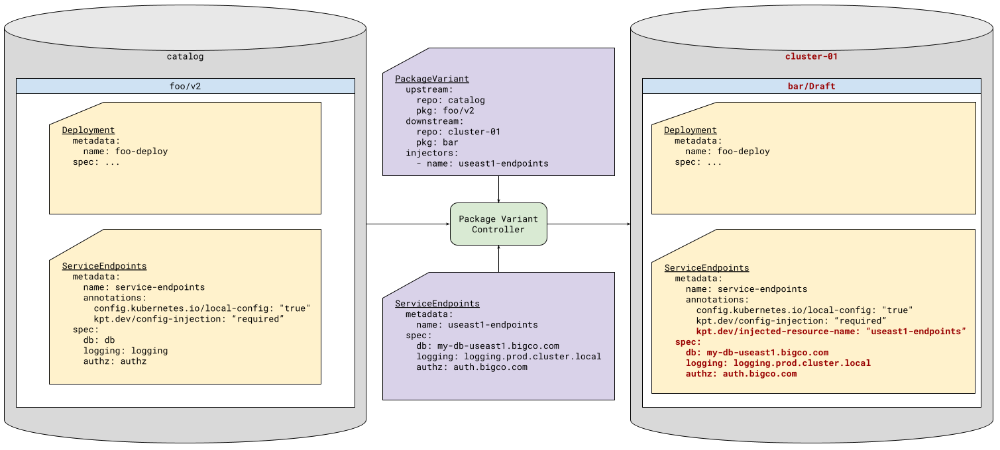
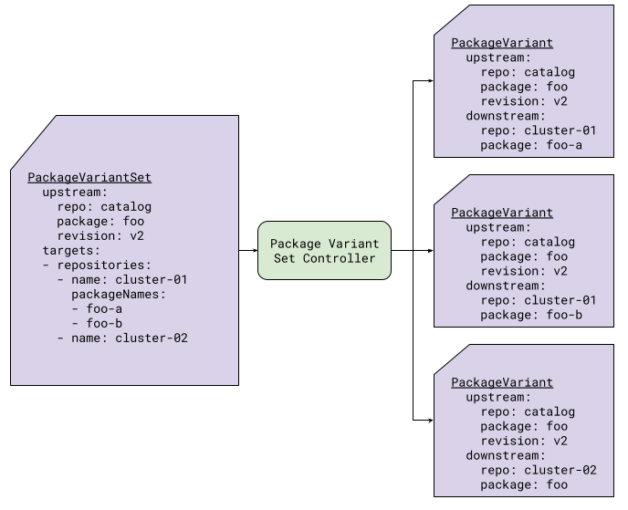
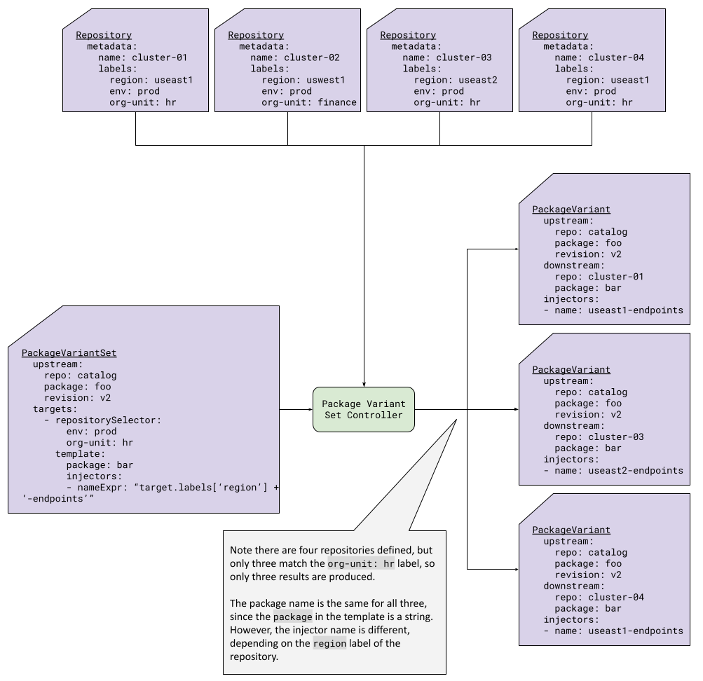

# Package Variant Controller

* Author(s): @johnbelamaric, @natasha41575
* Approver: @mortent

## Why

When deploying workloads across large fleets of clusters, it is often necessary
to modify the workload configuration for a specific cluster. Additionally, those
workloads may evolve over time with security or other patches that require
updates. [Configuration as Data](06-config-as-data.md) in general and [Package
Orchestration](07-package-orchestration.md) in particular can assist in this.
However, they are still centered around manual, one-by-one hydration and
configuration of a workload.

This proposal introduces concepts and a set of resources for automating the
creation and lifecycle management of package variants. These are designed to
address several different dimensions of scalability:
- Number of different workloads for a given cluster
- Number of clusters across which those workloads are deployed
- Different types or characteristics of those clusters
- Complexity of the organizations deploying those workloads
- Changes to those workloads over time

## See Also
- [Package Orchestration](07-package-orchestration.md)
- [#3347](https://github.com/GoogleContainerTools/kpt/issues/3347) Bulk package
  creation
- [#3243](https://github.com/GoogleContainerTools/kpt/issues/3243) Support bulk
  package upgrades
- [#3488](https://github.com/GoogleContainerTools/kpt/issues/3488) Porch:
  BaseRevision controller aka Fan Out controller - but more
- [Managing Package
   Revisions](https://docs.google.com/document/d/1EzUUDxLm5jlEG9d47AQOxA2W6HmSWVjL1zqyIFkqV1I/edit?usp=sharing)
- [Porch UpstreamPolicy Resource
  API](https://docs.google.com/document/d/1OxNon_1ri4YOqNtEQivBgeRzIPuX9sOyu-nYukjwN1Q/edit?usp=sharing&resourcekey=0-2nDYYH5Kw58IwCatA4uDQw)

## Core Concepts

For this solution, "workloads" are represented by packages. "Package" is a more
general concept, being an arbitrary bundle of resources, and therefore is
sufficient to solve the originally stated problem.

The basic idea here is to introduce a PackageVariant resource that manages the
derivation of a variant of a package from the original source package, and to
manage the evolution of that variant over time. This effectively automates the
human-centered process for variant creation one might use with `kpt`:
1. Clone an upstream package locally
1. Make changes to the local package, setting values in resources and
   executing KRM functions
1. Push the package to a new repository and tag it as a new version

Similarly, PackageVariant can manage the process of updating a package when a
new version of the upstream package is published. In the human-centered
workflow, a user would use `kpt pkg update` to pull in changes to their
derivative package. When using a PackageVariant resource, the change would be
made to the upstream specification in the resource, and the controller would
propose a new Draft package reflecting the outcome of `kpt pkg update`.

By automating this process, we open up the possibility of performing systematic
changes that tie back to our different dimensions of scalability. We can use
data about the specific variant we are creating to lookup additional context in
the Porch cluster, and copy that information into the variant. That context is a
well-structured resource, not simply key/value pairs. KRM functions within the
package can interpret the resource, modifying other resources in the package
accordingly.  The context can come from multiple sources that vary differently
along those dimensions of scalability. For example, one piece of information may
vary by region, another by individual site, another by cloud provider, and yet
another based on whether we are deploying to development, staging, or production.
By utilizing resources in the Porch cluster as our input model, we can represent
this complexity in a manageable model that is reused across many packages,
rather than scattered in package-specific templates or key/value pairs without
any structure. KRM functions, also reused across packages but configured as
needed for the specific package, are used to interpret the resources within the
package. This decouples authoring of the packages, creation of the input model,
and deploy-time use of that input model within the packages, allowing those
activities to be performed by different teams or organizations.

We refer to the mechanism described above as *configuration injection*. It
enables dynamic, context-aware creation of variants. Another way to think about
it is as a continuous reconciliation, much like other Kubernetes controllers. In
this case, the inputs are a parent package `P` and a context `C` (which may be a
collection of many independent resources), with the output being the derived
package `D`. When a new version of `C` is created by updates to in-cluster
resources, we get a new revision of `D`, customized based upon the updated
context. Similarly, the user (or an automation) can monitor for new versions of
`P`; when one arrives, the PackageVariant can be updated to point to that new
version, resulting in a newly proposed Draft of `D`, updated to reflect the
upstream changes. This will be explained in more detail below.

This proposal also introduces a way to "fan-out", or create multiple
PackageVariant resources declaratively based upon a list or selector, with the
PackageVariantSet resource. This is combined with the injection mechanism to
enable generation of large sets of variants that are specialized to a particular
target repository, cluster, or other resource.

## Basic Package Cloning

The PackageVariant resource controls the creation and lifecycle of a variant
of a package. That is, it defines the original (upstream) package, the new
(downstream) package, and the changes (mutations) that need to be made to
transform the upstream into the downstream. It also allows the user to specify
policies around adoption, deletion, and update of package revisions that are
under the control of the package variant controller.

The simple clone operation is shown in *Figure 1*.

|  |  |
| :---: | :---: |
| *Figure 1: Basic Package Cloning* | *Legend* |


Note that *proposal* and *approval* are not handled by the package variant
controller. Those are left to humans or other controllers. The exception is the
proposal of deletion (there is no concept of a "Draft" deletion), which the
package variant control will do, depending upon the specified deletion policy.

### PackageRevision Metadata

The package variant controller utilizes Porch APIs. This means that it is not
just doing a `clone` operation, but in fact creating a Porch PackageRevision
resource. In particular, that resource can contain Kubernetes metadata that is
not part of the package as stored in the repository.

Some of that metadata is necessary for the management of the PackageRevision
by the package variant controller - for example, the owner reference indicating
which PackageVariant created the PackageRevision. These are not under the user's
control. However, the PackageVariant resource does make the annotations and
labels of the PackageRevision available as values that may be controlled
during the creation of the PackageRevision. This can assist in additional
automation workflows.

## Introducing Variance
Just cloning is not that interesting, so the PackageVariant resource also
allows you to control various ways of mutating the original package to create
the variant.

### Package Context[^porch17]
Every kpt package that is fetched with `--for-deployment` will contain a
ConfigMap called `kptfile.kpt.dev`. Analogously, when Porch creates a package
in a deployment repository, it will create this ConfigMap, if it does not
already exist. Kpt (or Porch) will automatically add a key `name` to the
ConfigMap data, with the value of the package name. This ConfigMap can then
be used as input to functions in the Kpt function pipeline.

This process holds true for package revisions created via the package variant
controller as well. Additionally, the author of the PackageVariant resource
can specify additional key-value pairs to insert into the package
context, as shown in *Figure 2*.

|  |
| :---: |
| *Figure 2: Package Context Mutation * |

While this is convenient, it can be easily abused, leading to
over-parameterization. The preferred approach is configuration injection, as
described below, since it allows inputs to adhere to a well-defined, reusable
schema, rather than simple key/value pairs.

### Kptfile Function Pipeline Editing[^porch18]
In the manual workflow, one of the ways we edit packages is by running KRM
functions imperatively. PackageVariant offers a similar capability, by
allowing the user to add functions to the beginning of the downstream package
`Kptfile` mutators pipeline. These functions will then execute before the
functions present in the upstream pipeline. It is not exactly the same as
running functions imperatively, because they will also be run in every
subsequent execution of the downstream package function pipeline. But it can
achieve the same goals.

For example, consider an upstream package that includes a Namespace resource.
In many organizations, the deployer of the workload may not have the permissions
to provision cluster-scoped resources like namespaces. This means that they
would not be able to use this upstream package without removing the Namespace
resource (assuming that they only have access to a pipeline that deploys with
constrained permissions). By adding a function that removes Namespace resources,
and a call to `set-namespace`, they can take advantage of the upstream package.

Similarly, the Kptfile pipeline editing feature provides an easy mechanism for
the deployer to create and set the namespace if their downstream package
application pipeline allows it, as seen in *Figure 3*.[^setns]

|  |
| :---: |
| *Figure 3: Kptfile Function Pipeline Editing * |

### Configuration Injection[^porch18]

Adding values to the package context or functions to the pipeline works
for configuration that is under the control of the creator of the PackageVariant
resource. However, in more advanced use cases, we may need to specialize the
package based upon other contextual information. This particularly comes into
play when the user deploying the workload does not have direct control over the
context in which it is being deployed. For example, one part of the organization
may manage the infrastructure - that is, the cluster in which we are deploying
the workload - and another part the actual workload. We would like to be able to
pull in inputs specified by the infrastructure team automatically, based the
cluster to which we are deploying the workload, or perhaps the region in which
that cluster is deployed.

To facilitate this, the package variant controller can "inject" configuration
directly into the package. This means it will use information specific to this
instance of the package to lookup a resource in the Porch cluster, and copy that
information into the package. Of course, the package has to be ready to receive
this information. So, there is a protocol for facilitating this dance:
- Packages may contain resources annotated with `kpt.dev/config-injection`
- Often, these will also be `config.kubernetes.io/local-config` resources, as
  they are likely just used by local functions as input. But this is not
  mandatory.
- The package variant controller will look for any resource in the Kubernetes
  cluster matching the Group, Version, and Kind of the package resource, and
  satisfying the *injection selector*.
- The package variant controller will copy the `spec` field from the matching
  in-cluster resource to the in-package resource, or the `data` field in the
  case of a ConfigMap.

|  |
| :---: |
| *Figure 4: Configuration Injection* |


Note that because we are injecting data *from the Kubernetes cluster*, we can
also monitor that data for changes. For each resource we inject, the package
variant controller will establish a Kubernetes "watch" on the resource (or
perhaps on the collection of such resources). A change to that resource will
result in a new Draft package with the updated configuration injected.

There are a number of additional details that will be described in the detailed
design below, along with the specific API definition.

## Lifecycle Management

### Upstream Changes
The package variant controller allows you to specific a specific upstream
package revision to clone, or you can specify a floating tag[^notimplemented].

If you specify a specific upstream revision, then the downstream will not be
changed unless the PackageVariant resource itself is modified to point to a new
revision. That is, the user must edit the PackageVariant, and change the
upstream package reference. When that is done, the package variant controller
will update any existing Draft package under its ownership by doing the
equivalent of a `kpt pkg update` to update the downstream to be based upon
the new upstream revision. If a Draft does not exist, then the package variant
controller will create a new Draft based on the current published downstream,
and apply the `kpt pkg update`. This updated Draft must then be proposed and
approved like any other package change.

If a floating tag is used, then explicit modification of the PackageVariant is
not needed. Rather, when the floating tag is moved to a new tagged revision of
the upstream package, the package revision controller will notice and
automatically propose and update to that revision. For example, the upstream
package author may designate three floating tags: stable, beta, and alpha. The
upstream package author can move these tags to specific revisions, and any
PackageVariant resource tracking them will propose updates to their downstream
packages.

### Adoption and Deletion Policies
When a PackageVariant resource is created, it will have a particular
repository and package name as the downstream. The adoption policy controls
whether the package variant controller takes over an existing package with that
name, in that repository.

Analogously, when a PackageVariant resource is deleted, a decision must be
made about whether or not to delete the downstream package. This is controlled
by the deletion policy.

## Fan Out of Variant Generation[^pvsimpl]

When used with a single package, the package variant controller mostly helps us
handle the time dimension - producing new versions of a package as the upstream
changes, or as injected resources are updated. It can also be useful for
automating common, systematic changes made when bringing an external package
into an organization, or an organizational package into a team repository.

That is useful, but not extremely compelling by itself. More interesting is when
we use PackageVariant as a primitive for automations that act on other
dimensions of scale. That means writing controllers that emit PackageVariant
resources. For example, we can create a controller that instantiates a
PackageVariant for each developer in our organization, or we can create
a controller to manage PackageVariants across environments. The ability to not
only clone a package, but make systematic changes to that package enables
flexible automation.

Workload controllers in Kubernetes are a useful analogy. In Kubernetes, we have
different workload controllers such as Deployment, StatefulSet, and DaemonSet.
Ultimately, all of these result in Pods; however, the decisions about what Pods
to create, how to schedule them across Nodes, how to configure those Pods, and
how to manage those Pods as changes happen are very different with each workload
controller. Similarly, we can build different controllers to handle different
ways in which we want to generate PackageRevisions. The PackageVariant
resource provides a convenient primitive for all of those controllers, allowing
a them to leverage a range of well-defined operations to mutate the packages as
needed.

A common need is the ability to generate many variants of a package based on
a simple list of some entity. Some examples include generating package variants
to spin up development environments for each developer in an organization;
instantiating the same package, with slight configuration changes, across a
fleet of clusters; or instantiating some package per customer.

The package variant set controller is designed to fill this common need. This
controller consumes PackageVariantSet resources, and outputs PackageVariant
resources. The PackageVariantSet defines:
- the upstream package
- targeting criteria
- a template for generating one PackageVariant per target

Three types of targeting are supported:
- An explicit list of repositories and package names
- A label selector for Repository objects
- An arbitrary object selector

Rules for generating a PackageVariant are associated with a list of targets
using a template. That template can have explicit values for various
PackageVariant fields, or it can use [Common Expression Language
(CEL)](https://github.com/google/cel-go) expressions to specify the field
values.

*Figure 5* shows an example of creating PackageVariant resources based upon the
explicitly list of repositories. In this example, for the `cluster-01` and
`cluster-02` repositories, no template is defined the resulting PackageVariants;
it simply takes the defaults. However, for `cluster-03`, a template is defined
to change the downstream package name to `bar`.

|  |
| :---: |
| *Figure 5: PackageVariantSet with Repository List* |

It is also possible to target the same package to a repository more than once,
using different names. This is useful, for example, if the package is used to
provision namespaces and you would like to provision many namespaces in the same
cluster. It is also useful if a repository is shared across multiple clusters.
In *Figure 6*, two PackageVariant resources for creating the `foo` package in
the repository `cluster-01` are generated, one for each listed package name.
Since no `packageNames` field is listed for `cluster-02`, only one instance is
created for that repository.

|  |
| :---: |
| *Figure 6: PackageVariantSet with Package List* |

*Figure 7* shows an example that combines a repository label selector with
configuration injection that various based upon the target. The template for the
PackageVariant includes a CEL expression for the one of the injectors, so that
the injection varies systematically based upon attributes of the target.

|  |
| :---: |
| *Figure 7: PackageVariantSet with Repository Selector* |

## Detailed Design

### PackageVariant API

The Go types below defines the `PackageVariantSpec`.

```go
type PackageVariantSpec struct {
        Upstream   *Upstream   `json:"upstream,omitempty"`
        Downstream *Downstream `json:"downstream,omitempty"`

        AdoptionPolicy AdoptionPolicy `json:"adoptionPolicy,omitempty"`
        DeletionPolicy DeletionPolicy `json:"deletionPolicy,omitempty"`

        Labels      map[string]string `json:"labels,omitempty"`
        Annotations map[string]string `json:"annotations,omitempty"`

        PackageContext *PackageContext     `json:"packageContext,omitempty"`
        Pipeline       *kptfilev1.Pipeline `json:"pipeline,omitempty"`
        Injectors      []InjectionSelector `json:"injectors,omitempty"`
}

type Upstream struct {
        Repo     string `json:"repo,omitempty"`
        Package  string `json:"package,omitempty"`
        Revision string `json:"revision,omitempty"`
}

type Downstream struct {
        Repo    string `json:"repo,omitempty"`
        Package string `json:"package,omitempty"`
}

type PackageContext struct {
        Data       map[string]string `json:"data,omitempty"`
        RemoveKeys []string          `json:"removeKeys,omitempty"`
}

type InjectionSelector struct {
        Group   *string `json:"group,omitempty"`
        Version *string `json:"version,omitempty"`
        Kind    *string `json:"kind,omitempty"`
        Name    string  `json:"name"`
}

```

#### Basic Spec Fields

The `Upstream` and `Downstream` fields specify the source package and
destination repository and package name. The `Repo` fields refer to the names
Porch Repository resources in the same namespace as the PackageVariant resource.
The `Downstream` does not contain a revision, because the package variant
controller will only create Draft packages. The `Revision` of the eventual
PackageRevision resource will be determined by Porch at the time of approval.

The `Labels` and `Annotations` fields list metadata to include on the created
PackageRevision. These values are set *only* at the time a Draft package is
created. They are ignored for subsequent operations, even if the PackageVariant
itself has been modified. This means users are free to change these values on
the PackageRevision; the package variant controller will not touch them again.

`AdoptionPolicy` controls how the package variant controller behaves if it finds
an existing PackageRevision Draft matching the `Downstream`. If the
`AdoptionPolicy` is `adoptExisting`, then the package variant controller will
take ownership of the Draft, associating it with this PackageVariant. This means
that it will begin to reconcile the Draft, just as if it had created it in the
first place. An `AdoptionPolicy` of `adoptNone` (the default) will simply ignore
any matching Drafts that were not created by the controller.

`DeletionPolicy` controls how the package variant controller behaves with
respect to PackageRevisions that it has created when the PackageVariant resource
itself is deleted. A value of `delete` (the default) will delete the
PackageRevision (potentially removing it from a running cluster, if the
downstream package has been deployed). A value of `orphan` will remove the owner
references and leave the PackageRevisions in place.

#### Package Context Injection

PackageVariant resource authors may specify key-value pairs in the
`spec.packageContext.data` field of the resource. These key-value pairs will be
automatically added to the `data` of the `kptfile.kpt.dev` ConfigMap, if it
exists.

Specifying the key `name` is invalid and must fail validation of the
PackageVariant. This key is reserved for kpt or Porch to set to the package
name. Similarly, `package-path` is reserved and will result in an error.

The `spec.packageContext.removeKeys` field can also be used to specify a list of
keys that the package variant controller should remove from the `data` field of
the `kptfile.kpt.dev` ConfigMap.

When creating or updating a package, the package variant controller will ensure
that:
- The `kptfile.kpt.dev` ConfigMap exists, failing if not
- All of the key-value pairs in `spec.packageContext.data` exist in the `data`
  field of the ConfigMap.
- None of the keys listed in `spec.packageContext.removeKeys` exist in the
  ConfigMap.

Note that if a user adds a key via PackageVariant, then changes the
PackageVariant to no longer add that key, it will NOT be removed automatically,
unless the user also lists the key in the `removeKeys` list. This avoids the
need to track which keys were added by PackageVariant.

Similarly, if a user manually adds a key in the downstream that is also listed
in the `removeKeys` field, the package variant controller will remove that key
the next time it needs to update the downstream package. There will be no
attempt to coordinate "ownership" of these keys.

If the controller is unable to modify the ConfigMap for some reason, this is
considered an error and should prevent generation of the Draft. This will result
in the condition `Ready` being set to `False`.

#### Kptfile Function Pipeline Editing

PackageVariant resource creators may specify a list of KRM functions to add to
the beginning of the Kptfile's pipeline. These functions are listed in the field
`spec.pipeline`, which is a
[Pipeline](https://github.com/GoogleContainerTools/kpt/blob/cf1f326486214f6b4469d8432287a2fa705b48f5/pkg/api/kptfile/v1/types.go#L236),
just as in the Kptfile. The user can therefore prepend both `validators` and
`mutators`.

Functions added in this way are always added to the *beginning* of the Kptfile
pipeline. In order to enable management of the list on subsequent
reconciliations, functions added by the package variant controller will use the
`Name` field of the
[Function](https://github.com/GoogleContainerTools/kpt/blob/cf1f326486214f6b4469d8432287a2fa705b48f5/pkg/api/kptfile/v1/types.go#L283).
In the Kptfile, each function will be named as the dot-delimited concatenation
of `PackageVariant`, the name of the PackageVariant resource, the function name
as specified in the pipeline of the PackageVariant resource (if present), and
the positional location of the function in the array.

For example, if the PackageVariant resource contains:

```yaml
apiVersion: config.porch.kpt.dev/v1alpha1
kind: PackageVariant
metadata:
  namespace: default
  name: my-pv
spec:
  ...
  pipeline:
    mutators:
    - image: gcr.io/kpt-fn/set-namespace:v0.1
      configMap:
        namespace: my-ns
      name: my-func
    - image: gcr.io/kpt-fn/set-labels:v0.1
      configMap:
        app: foo
```

Then the resulting Kptfile will have these two entries prepended to its
`mutators` list:

```yaml
  pipeline:
    mutators:
    - image: gcr.io/kpt-fn/set-namespace:v0.1
      configMap:
        namespace: my-ns
      name: PackageVariant.my-pv.my-func.0
    - image: gcr.io/kpt-fn/set-labels:v0.1
      configMap:
        app: foo
      name: PackageVariant.my-pv..1
```

During subsequent reconciliations, this allows the controller to identify the
functions within its control, remove them all, and re-add them based on its
updated content. By including the PackageVariant name, we enable chains of
PackageVariants to add functions, so long as the user is careful about their
choice of resource names and avoids conflicts.

If the controller is unable to modify the Pipeline for some reason, this is
considered an error and should prevent generation of the Draft. This will result
in the condition `Ready` being set to `False`.

#### Configuration Injection Details

As described [above](#configuration-injection), configuration injection is a
process whereby in-package resources are matched to in-cluster resources, and
the `spec` of the in-cluster resources is copied to the in-package resource.

Configuration injection is controlled by a combination of in-package resources
with annotations, and *injectors* (also known as *injection selectors*) defined
on the PackageVariant resource. Package authors control the injection points
they allow in their packages, by flagging specific resources as *injection
points* with an annotation. Creators of the PackageVariant resource specify how
to map in-cluster resources to those injection points using the injection
selectors. Injection selectors are defined in the `spec.injectors` field of the
PackageVariant. This field is an ordered array of structs containing a GVK
(group, version, kind) tuple as separate fields, and name. Only the name is
required. To identify a match, all fields present must match the in-cluster
object, and all *GVK* fields present must match the in-package resource. In
general the name will not match the in-package resource; this is discussed in
more detail below.

The annotations, along with the GVK of the annotated resource, allow a package
to "advertise" the injections it can accept and understand. These injection
points effectively form a configuration API for the package, and the injection
selectors provide a way for the PackageVariant author to specify the inputs
for those APIs from the possible values in the management cluster. If we define
those APIs carefully, they can be used across many packages; since they are
KRM resources, we can apply versioning and schema validation to them as well.
This creates a more maintainable, automatable set of APIs for package
customization than simple key/value pairs.

As an example, we may define a GVK that contains service endpoints that many
applications use. In each application package, we would then include an instance
of that resource, say called "service-endpoints", and configure a function to
propagate the values from that resource to others within our package. As those
endpoints may vary by region, in our Porch cluster we can create an instance of
this GVK for each region: "useast1-service-endpoints",
"useast2-service-endpoints", "uswest1-service-endpoints", etc. When we
instantiate the PackageVariant for a cluster, we want to inject the resource
corresponding to the region in which the cluster exists. Thus, for each cluster
we will create a PackageVariant resource pointing to the upstream package, but
with injection selector name values that are specific to the region for that
cluster.

It is important to realize that the name of the in-package resource and the in-
cluster resource need not match. In fact, it would be an unusual coincidence if
they did match. The names in the package are the same across PackageVariants
using that upstream, but we want to inject different resources for each one such
PackageVariant. We also do not want to change the name in the package, because
it likely has meaning within the package and will be used by functions in the
package. Also, different owners control the names of the in-package and in-
cluster resources. The names in the package are in the control of the package
author. The names in the cluster are in the control of whoever populates the
cluster (for example, some infrastructure team). The selector is the glue
between them, and is in control of the PackageVariant resource creator.

The GVK on the other hand, has to be the same for the in-package resource and
the in-cluster resource, because it tells us the API schema for the resource.
Also, the namespace of the in-cluster object needs to be the same as the
PackageVariant resource, or we could leak resources from namespaces to which
our PackageVariant user does not have access.

With that understanding, the injection process works as follows:

1. The controller will examine all in-package resources, looking for those with
   an annotation named `kpt.dev/config-injection`, with one of the following
   values: `required` or `optional`. We will call these "injection points". It
   is the responsibility of the package author to define these injection points,
   and to specify which are required and which are optional. Optional injection
   points are a way of specifying default values.
1. For each injection point, a condition will be created *in the
   downstream PackageRevision*, with ConditionType set to the dot-delimited
   concatenation of `config.injection`, with the in-package resource kind and
   name, and the value set to `False`. Note that since the package author
   controls the name of the resource, kind and name are sufficient to
   disambiguate the injection point. We will call this ConditionType the
   "injection point ConditionType".
1. For each required injection point, the injection point ConditionType will
   be added to the PackageRevision `readinessGates` by the package variant
   controller. Optional injection points' ConditionTypes must not be added to
   the `readinessGates` by the package variant controller, but humans or other
   actors may do so at a later date, and the package variant controller should
   not remove them on subsequent reconciliations. Also, this relies upon
   `readinessGates` gating publishing the package to a *deployment* repository,
   but not gating publishing to a blueprint repository.
1. The injection processing will proceed as follows. For each injection point:
   - The controller will identify all in-cluster objects in the same
     namespace as the PackageVariant resource, with GVK matching the injection
     point (the in-package resource). If the controller is unable to load this
     objects (e.g., there are none and the CRD is not installed), the injection
     point ConditionType will be set to `False`, with a message indicating that
     the error, and processing proceeds to the next injection point. Note that
     for `optional` injection this may be an acceptable outcome, so it does not
     interfere with overall generation of the Draft.
   - The controller will look through the list of injection selectors in
     order and checking if any of the in-cluster objects match the selector. If
     so, that in-cluster object is selected, and processing of the list of
     injection selectors stops. Note that the namespace is set based upon the
     PackageVariant resource, the GVK is set based upon the in-package resource,
     and all selectors require name. Thus, at most one match is possible for any
     given selector. Also note that *all fields present in the selector* must
     match the in-cluster resource, and only the *GVK fields present in the
     selector* must match the in-package resource.
   - If no in-cluster object is selected, the injection point ConditionType will
     be set to `False` with a message that no matching in-cluster resource was
     found, and processing proceeds to the next injection point.
   - If a matching in-cluster object is selected, then it is injected as
     follows:
     - For ConfigMap resources, the `data` field from the in-cluster resource is
       copied to the `data` field of the in-package resource (the injection
       point), overwriting it.
     - For other resource types, the `spec` field from the in-cluster resource
       is copied to the `spec` field of the in-package resource (the injection
       point), overwriting it.
     - An annotation with name `kpt.dev/injected-resource-name` and value set to
       the name of the in-cluster resource is added (or overwritten) in the
       in-package resource.

If the the overall injection cannot be completed for some reason, or if any of
the below problems exist in the upstream package, it is considered an error and
should prevent generation of the Draft:
   - There is a resource annotated as an injection point but having an invalid
     annotation value (i.e., other than `required` or `optional`).
   - There are ambiguous condition types due to conflicting GVK and name
     values. These must be disambiguated in the upstream package, if so.

This will result in the condition `Ready` being set to `False`.

Note that whether or not all `required` injection points are fulfilled does not
affect the *PackageVariant* conditions, only the *PackageRevision* conditions.

**A Further Note on Selectors**

Note that by allowing the use of GVK, not just name, in the selector, more
precision in selection is enabled. This is a way to constrain the injections
that will be done. That is, if the package has 10 different objects with
`config-injection` annotation, the PackageVariant could say it only wants to
replace certain GVKs, allowing better control.

Consider, for example, if the cluster contains these resources:

- GVK1 foo
- GVK1 bar
- GVK2 foo
- GVK2 bar

If we could only define injection selectors based upon name, it would be
impossible to ever inject one GVK with `foo` and another with `bar`. Instead,
by using GVK, we can accomplish this with a list of selectors like:

 - GVK1 foo
 - GVK2 bar

That said, often name will be sufficiently unique when combined with the
in-package resource GVK, and so making the selector GVK optional is more
convenient. This allows a single injector to apply to multiple injection points
with different GVKs.

#### Order of Mutations

During creation, the first thing the controller does is clone the upstream
package to create the downstream package.

For update, first note that changes to the downstream PackageRevision can be
triggered for several different reasons:

1. The PackageVariant resource is updated, which could change any of the options
   for introducing variance, or could also change the upstream package revision
   referenced.
1. A new revision of the upstream package has been selected due to a floating
   tag change, or due to a force retagging of the upstream.
1. An injected in-cluster object is updated.

The downstream PackageRevision may have been updated by humans or other
automation actors since creation, so we cannot simply recreate the downstream
PackageRevision from scratch when one of these changes happens. Instead, the
controller must maintain the later edits by doing the equivalent of a `kpt pkg
update`, in the case of changes to the upstream for any reason. Any other
changes require reapplication of the PackageVariant functionality. With that
understanding, we can see that the controller will perform mutations on the
downstream package in this order, for both creation and update:

1. Create (via Clone) or Update (via `kpt pkg update` equivalent)
   - This is done by the Porch server, not by the package variant controller
     directly.
   - This means that Porch will run the Kptfile pipeline after clone or
     update.
1. Package variant controller applies configured mutations
   - Package Context Injections
   - Kptfile KRM Function Pipeline Additions/Changes
   - Config Injection
1. Package variant controller saves the PackageRevision and
   PackageRevisionResources.
   - Porch server executes the Kptfile pipeline

The package variant controller mutations edit resources (including the Kptfile),
based on the contents of the PackageVariant and the injected in-cluster
resources, but cannot affect one another. The results of those mutations
throughout the rest of the package is materialized by the execution of the
Kptfile pipeline during the save operation.

#### PackageVariant Status

PackageVariant sets the following status conditions:
 - `Stalled` is set to True if there has been a failure that most likely
   requires user intervention.
 - `Ready` is set to True if the last reconciliation successfully produced an
   up-to-date Draft.

The PackageVariant resource will also contain a `DownstreamTargets` field,
containing a list of downstream `Draft` and `Proposed` PackageRevisions owned by
this PackageVariant resource, or the latest `Published` PackageRevision if there
are none in `Draft` or `Proposed` state. Typically, there is only a single
Draft, but use of the `adopt` value for `AdoptionPolicy` could result in
multiple Drafts being owned by the same PackageVariant.

### PackageVariantSet API[^pvsimpl]

The Go types below defines the `PackageVariantSetSpec`.

```go
// PackageVariantSetSpec defines the desired state of PackageVariantSet
type PackageVariantSetSpec struct {
        Upstream *pkgvarapi.Upstream `json:"upstream,omitempty"`
        Targets  []Target            `json:"targets,omitempty"`
}

type Target struct {
        // Exactly one of Repositories, RepositorySeletor, and ObjectSelector must be
        // populated
        // option 1: an explicit repositories and package names
        Repositories []RepositoryTarget `json:"repositories,omitempty"`

        // option 2: a label selector against a set of repositories
        RepositorySelector *metav1.LabelSelector `json:"repositorySelector,omitempty"`

        // option 3: a selector against a set of arbitrary objects
        ObjectSelector *ObjectSelector `json:"objectSelector,omitempty"`

        // Template specifies how to generate a PackageVariant from a target
        Template *PackageVariantTemplate `json:"template,omitempty"`
}
```

At the highest level, a PackageVariantSet is just an upstream, and a list of
targets. For each target, there is a set of criteria for generating a list, and
a set of rules (a template) for creating a PackageVariant from each list entry.

Since `template` is optional, lets start with describing the different types of
targets, and how the criteria in each is used to generate a list that seeds the
PackageVariant resources.

The `Target` structure must include exactly one of three different ways of
generating the list. The first is a simple list of repositories and package
names for each of those repositories[^repo-pkg-expr]. The package name list is
needed for uses cases in which you want to repeatedly instantiate the same
package in a single repository. For example, if a repository represents the
contents of a cluster, you may want to instantiate a namespace package once for
each namespace, with a name matching the namespace.

This example shows using the `repositories` field:

```yaml
apiVersion: config.porch.kpt.dev/v1alpha2
kind: PackageVariantSet
metadata:
  namespace: default
  name: example
spec:
  upstream:
    repo: example-repo
    package: foo
    revision: v1
  targets:
  - repositories:
    - name: cluster-01
    - name: cluster-02
    - name: cluster-03
      packageNames:
      - foo-a
      - foo-b
      - foo-c
    - name: cluster-04
      packageNames:
      - foo-a
      - foo-b
```

In this case, PackageVariant resources are created for each of these pairs of
downstream repositories and packages names:

| Repository | Package Name |
| ---------- | ------------ |
| cluster-01 | foo          |
| cluster-02 | foo          |
| cluster-03 | foo-a        |
| cluster-03 | foo-b        |
| cluster-03 | foo-c        |
| cluster-04 | foo-a        |
| cluster-04 | foo-b        |

All of those PackageVariants have the same upstream.

The second criteria targeting is via a label selector against Porch Repository
objects, along with a list of package names. Those packages will be instantiated
in each matching repository. Just like in the first example, not listing a
package name defaults to one package, with the same name as the upstream
package. Suppose, for example, we have these four repositories defined in our
Porch cluster:

| Repository | Labels                                |
| ---------- | ------------------------------------- |
| cluster-01 | region=useast1, env=prod, org=hr      |
| cluster-02 | region=uswest1, env=prod, org=finance |
| cluster-03 | region=useast2, env=prod, org=hr      |
| cluster-04 | region=uswest1, env=prod, org=hr      |

If we create a PackageVariantSet with the following `spec`:

```yaml
spec:
  upstream:
    repo: example-repo
    package: foo
    revision: v1
  targets:
  - repositorySelector:
      matchLabels:
        env: prod
        org: hr
  - repositorySelector:
      matchLabels:
        region: uswest1
      packageNames:
      - foo-a
      - foo-b
      - foo-c
```

then PackageVariant resources will be created with these repository and package
names:

| Repository | Package Name |
| ---------- | ------------ |
| cluster-01 | foo          |
| cluster-03 | foo          |
| cluster-04 | foo          |
| cluster-02 | foo-a        |
| cluster-02 | foo-b        |
| cluster-02 | foo-c        |
| cluster-04 | foo-a        |
| cluster-04 | foo-b        |
| cluster-04 | foo-c        |

Finally, the third possibility allows the use of *arbitrary* resources in the
Porch cluster as targeting criteria. The `objectSelector` looks like this:

```yaml
spec:
  upstream:
    repo: example-repo
    package: foo
    revision: v1
  targets:
  - objectSelector:
      apiVersion: krm-platform.bigco.com/v1
      kind: Team
      matchLabels:
        org: hr
        role: dev
```

It works exactly like the repository selector - in fact the repository selector
is equivalent to the object selector with the `apiVersion` and `kind` values set
to point to Porch Repository resources. That is, the repository name comes from
the object name, and the package names come from the listed package names. In
the description of the template, we will see how to derive different repository
names from the objects.

#### PackageVariant Template

As previously discussed, the list entries generated by the target criteria
result in PackageVariant entries. If no template is specified, then
PackageVariant default are used, along with the downstream repository name and
package name as described in the previous section. The template allows the user
to have control over all of the values in the resulting PackageVariant. The
template API is shown below.

```go
type PackageVariantTemplate struct {
	// Downstream allows overriding the default downstream package and repository name
	// +optional
	Downstream *DownstreamTemplate `json:"downstream,omitempty"`

	// AdoptionPolicy allows overriding the PackageVariant adoption policy
	// +optional
	AdoptionPolicy *pkgvarapi.AdoptionPolicy `json:"adoptionPolicy,omitempty"`

	// DeletionPolicy allows overriding the PackageVariant deletion policy
	// +optional
	DeletionPolicy *pkgvarapi.DeletionPolicy `json:"deletionPolicy,omitempty"`

	// Labels allows specifying the spec.Labels field of the generated PackageVariant
	// +optional
	Labels map[string]string `json:"labels,omitempty"`

	// LabelsExprs allows specifying the spec.Labels field of the generated PackageVariant
	// using CEL to dynamically create the keys and values. Entries in this field take precedent over
	// those with the same keys that are present in Labels.
	// +optional
	LabelExprs []MapExpr `json:"labelExprs,omitempty"`

	// Annotations allows specifying the spec.Annotations field of the generated PackageVariant
	// +optional
	Annotations map[string]string `json:"annotations,omitempty"`

	// AnnotationsExprs allows specifying the spec.Annotations field of the generated PackageVariant
	// using CEL to dynamically create the keys and values. Entries in this field take precedent over
	// those with the same keys that are present in Annotations.
	// +optional
	AnnotationExprs []MapExpr `json:"annotationExprs,omitempty"`

	// PackageContext allows specifying the spec.PackageContext field of the generated PackageVariant
	// +optional
	PackageContext *PackageContextTemplate `json:"packageContext,omitempty"`

	// Pipeline allows specifying the spec.Pipeline field of the generated PackageVariant
	// +optional
	Pipeline *PipelineTemplate `json:"pipeline,omitempty"`

	// Injectors allows specifying the spec.Injectors field of the generated PackageVariant
	// +optional
	Injectors []InjectionSelectorTemplate `json:"injectors,omitempty"`
}

// DownstreamTemplate is used to calculate the downstream field of the resulting
// package variants. Only one of Repo and RepoExpr may be specified;
// similarly only one of Package and PackageExpr may be specified.
type DownstreamTemplate struct {
	Repo        *string `json:"repo,omitempty"`
	Package     *string `json:"package,omitempty"`
	RepoExpr    *string `json:"repoExpr,omitempty"`
	PackageExpr *string `json:"packageExpr,omitempty"`
}

// PackageContextTemplate is used to calculate the packageContext field of the
// resulting package variants. The plain fields and Exprs fields will be
// merged, with the Exprs fields taking precedence.
type PackageContextTemplate struct {
	Data           map[string]string `json:"data,omitempty"`
	RemoveKeys     []string          `json:"removeKeys,omitempty"`
	DataExprs      []MapExpr         `json:"dataExprs,omitempty"`
	RemoveKeyExprs []string          `json:"removeKeyExprs,omitempty"`
}

// InjectionSelectorTemplate is used to calculate the injectors field of the
// resulting package variants. Exactly one of the Name and NameExpr fields must
// be specified. The other fields are optional.
type InjectionSelectorTemplate struct {
	Group   *string `json:"group,omitempty"`
	Version *string `json:"version,omitempty"`
	Kind    *string `json:"kind,omitempty"`
	Name    *string `json:"name,omitempty"`

	NameExpr *string `json:"nameExpr,omitempty"`
}

// MapExpr is used for various fields to calculate map entries. Only one of
// Key and KeyExpr may be specified; similarly only on of Value and ValueExpr
// may be specified.
type MapExpr struct {
	Key       *string `json:"key,omitempty"`
	Value     *string `json:"value,omitempty"`
	KeyExpr   *string `json:"keyExpr,omitempty"`
	ValueExpr *string `json:"valueExpr,omitempty"`
}

// PipelineTemplate is used to calculate the pipeline field of the resulting
// package variants.
type PipelineTemplate struct {
	// Validators is used to caculate the pipeline.validators field of the
	// resulting package variants.
	// +optional
	Validators []FunctionTemplate `json:"validators,omitempty"`

	// Mutators is used to caculate the pipeline.mutators field of the
	// resulting package variants.
	// +optional
	Mutators []FunctionTemplate `json:"mutators,omitempty"`
}

// FunctionTemplate is used in generating KRM function pipeline entries; that
// is, it is used to generate Kptfile Function objects.
type FunctionTemplate struct {
	kptfilev1.Function `json:",inline"`

	// ConfigMapExprs allows use of CEL to dynamically create the keys and values in the
	// function config ConfigMap. Entries in this field take precedent over those with
	// the same keys that are present in ConfigMap.
	// +optional
	ConfigMapExprs []MapExpr `json:"configMapExprs,omitempty"`
}
```

This is a pretty complicated structure. To make it more understandable, the
first thing to notice is that many fields have a plain version, and an `Expr`
version. The plain version is used when the value is static across all the
PackageVariants; the `Expr` version is used when the value needs to vary across
PackageVariants.

Let's consider a simple example. Suppose we have a package for provisioning
namespaces called "base-ns". We want to instantiate this several times in the
`cluster-01` repository. We could do this with this PackageVariantSet:

```yaml
apiVersion: config.porch.kpt.dev/v1alpha2
kind: PackageVariantSet
metadata:
  namespace: default
  name: example
spec:
  upstream:
    repo: platform-catalog
    package: base-ns
    revision: v1
  targets:
  - repositories:
    - name: cluster-01
      packageNames:
      - ns-1
      - ns-2
      - ns-3
```

That will produce three PackageVariant resources with the same upstream, all
with the same downstream repo, and each with a different downstream package
name. If we also want to set some labels identically across the packages, we can
do that with the `template.labels` field:

```yaml
apiVersion: config.porch.kpt.dev/v1alpha2
kind: PackageVariantSet
metadata:
  namespace: default
  name: example
spec:
  upstream:
    repo: platform-catalog
    package: base-ns
    revision: v1
  targets:
  - repositories:
    - name: cluster-01
      packageNames:
      - ns-1
      - ns-2
      - ns-3
    template:
      labels:
        package-type: namespace
        org: hr
```

The resulting PackageVariant resources will include `labels` in their `spec`,
and will be identical other than their names and the `downstream.package`:

```yaml
apiVersion: config.porch.kpt.dev/v1alpha1
kind: PackageVariant
metadata:
  namespace: default
  name: example-aaaa
spec:
  upstream:
    repo: platform-catalog
    package: base-ns
    revision: v1
  downstream:
    repo: cluster-01
    package: ns-1
  labels:
    package-type: namespace
    org: hr
---
apiVersion: config.porch.kpt.dev/v1alpha1
kind: PackageVariant
metadata:
  namespace: default
  name: example-aaab
spec:
  upstream:
    repo: platform-catalog
    package: base-ns
    revision: v1
  downstream:
    repo: cluster-01
    package: ns-2
  labels:
    package-type: namespace
    org: hr
---

apiVersion: config.porch.kpt.dev/v1alpha1
kind: PackageVariant
metadata:
  namespace: default
  name: example-aaac
spec:
  upstream:
    repo: platform-catalog
    package: base-ns
    revision: v1
  downstream:
    repo: cluster-01
    package: ns-3
  labels:
    package-type: namespace
    org: hr
```

When using other targeting means, the use of the `Expr` fields becomes more
likely, because we have more possible sources for different field values. The
`Expr` values are all [Common Expression Language (CEL)](https://github.com/google/cel-go)
expressions, rather than static values. This allows the user to construct values
based upon various fields of the targets. Consider again the
`repositorySelector` example, where we have these repositories in the cluster.

| Repository | Labels                                |
| ---------- | ------------------------------------- |
| cluster-01 | region=useast1, env=prod, org=hr      |
| cluster-02 | region=uswest1, env=prod, org=finance |
| cluster-03 | region=useast2, env=prod, org=hr      |
| cluster-04 | region=uswest1, env=prod, org=hr      |

If we create a PackageVariantSet with the following `spec`, we can use the
`Expr` fields to add labels to the PackageVariantSpecs (and thus to the
resulting PackageRevisions later) that vary based on cluster. We can also use
this to vary the `injectors` defined for each PackageVariant, resulting in each
PackageRevision having different resources injected. This `spec`:

```yaml
spec:
  upstream:
    repo: example-repo
    package: foo
    revision: v1
  targets:
  - repositorySelector:
      matchLabels:
        env: prod
        org: hr
    template:
      labelExprs:
        key: org
        valueExpr: "repository.labels['org']"
      injectorExprs:
        - nameExpr: "repository.labels['region'] + '-endpoints'"
```

will result in three PackageVariant resources, one for each Repository with the
labels env=prod and org=hr. The `labels` and `injectors` fields of the
PackageVariantSpec will be different for each of these PackageVariants, as
determined by the use of the `Expr` fields in the template, as shown here:

```yaml
apiVersion: config.porch.kpt.dev/v1alpha1
kind: PackageVariant
metadata:
  namespace: default
  name: example-aaaa
spec:
  upstream:
    repo: example-repo
    package: foo
    revision: v1
  downstream:
    repo: cluster-01
    package: foo
  labels:
    org: hr
  injectors:
    name: useast1-endpoints
---
apiVersion: config.porch.kpt.dev/v1alpha1
kind: PackageVariant
metadata:
  namespace: default
  name: example-aaab
spec:
  upstream:
    repo: example-repo
    package: foo
    revision: v1
  downstream:
    repo: cluster-03
    package: foo
  labels:
    org: hr
  injectors:
    name: useast2-endpoints
---
apiVersion: config.porch.kpt.dev/v1alpha1
kind: PackageVariant
metadata:
  namespace: default
  name: example-aaac
spec:
  upstream:
    repo: example-repo
    package: foo
    revision: v1
  downstream:
    repo: cluster-04
    package: foo
  labels:
    org: hr
  injectors:
    name: uswest1-endpoints
```

Since the injectors are different for each PackageVariant, the resulting
PackageRevisions will each have different resources injected.

When CEL expressions are evaluated, they have an environment associated with
them. That is, there are certain objects that are accessible within the CEL
expression. For CEL expressions used in the PackageVariantSet `template` field,
the following variables are available:

| CEL Variable   | Variable Contents                                            |
| -------------- | ------------------------------------------------------------ |
| repoDefault    | The default repository name based on the targeting criteria. |
| packageDefault | The default package name based on the targeting criteria.    |
| upstream       | The upstream PackageRevision.                                |
| repository     | The downstream Repository.                                   |
| target         | The target object (details vary; see below).                 |

There is one expression that is an exception to the table above. Since the
`repository` value corresponds to the Repository of the downstream, we must
first evaluate the `downstream.repoExpr` expression to *find* that
repository.  Thus, for that expression only, `repository` is not a valid
variable.

There is one more variable available across all CEL expressions: the `target`
variable. This variable has a meaning that varies depending on the type of
target, as follows:

| Target Type         | `target` Variable Contents |
| ------------------- | -------------------------- |
| Repo/Package List   | A struct with two fields: `repo` and `package`, the same as the `repoDefault` and `packageDefault` values. |
| Repository Selector | The Repository selected by the selector. Although not recommended, this could be different than the `repository` value, which can be altered with `downstream.repo` or `downstream.repoExpr`. |
| Object Selector     | The Object selected by the selector. |

For the various resource variables - `upstream`, `repository`, and `target` -
arbitrary access to all fields of the object could lead to security concerns.
Therefore, only a subset of the data is available for use in CEL expressions.
Specifically, the following fields: `name`, `namespace`, `labels`, and
`annotations`.

Given the slight quirk with the `repoExpr`, it may be helpful to state the
processing flow for the template evaluation:

1. The upstream PackageRevision is loaded. It must be in the same namespace as
   the PackageVariantSet[^multi-ns-reg].
1. The targets are determined.
1. For each target:
   1. The CEL environment is prepared with `repoDefault`, `packageDefault`,
      `upstream`, and `target` variables.
   1. The downstream repository is determined and loaded, as follows:
      - If present, `downstream.repoExpr` is evaluated using the CEL
        environment, and the result used as the downstream repository name.
      - Otherwise, if `downstream.repo` is set, that is used as the downstream
       repository name.
      - If neither is present, the default repository name based on the target is
        used (i.e., the same value as the `repoDefault` variable).
      - The resulting downstream repository name is used to load the corresponding
        Repository object in the same namespace as the PackageVariantSet.
   1. The downstream Repository is added to the CEL environment.
   1. All other CEL expressions are evaluated.
1. Note that if any of the resources (e.g., the upstream PackageRevision, or the
   downstream Repository) are not found our otherwise fail to load, processing
   stops and a failure condition is raised. Similarly, if a CEL expression
   cannot be properly evaluated due to syntax or other reasons, processing stops
   and a failure condition is raised.

#### Other Considerations
It would appear convenient to automatically inject the PackageVariantSet
targeting resource. However, it is better to require the package advertise
the ways it accepts injections (i.e., the GVKs it understands), and only inject
those. This keeps the separation of concerns cleaner; the package does not
build in an awareness of the context in which it expects to be deployed. For
example, a package should not accept a Porch Repository resource just because
that happens to be the targeting mechanism. That would make the package unusable
in other contexts.

#### PackageVariantSet Status

The PackageVariantSet status uses these conditions:
 - `Stalled` is set to True if there has been a failure that most likely
   requires user intervention.
 - `Ready` is set to True if the last reconciliation successfully reconciled
   all targeted PackageVariant resources.

## Future Considerations
- As an alternative to the floating tag proposal, we may instead want to have
  a separate tag tracking controller that can update PV and PVS resources to
  tweak their upstream as the tag moves.
- Installing a collection of packages across a set of clusters, or performing
  the same mutations to each package in a collection, is only supported by
  creating multiple PackageVariant / PackageVariantSet resources. Options to
  consider for these use cases:
  - `upstreams` listing multiple packages.
  - Label selector against PackageRevisions. This does not seem that useful, as
    PackageRevisions are highly re-usable and would likely be composed in many
    different ways.
  - A PackageRevisionSet resource that simply contained a list of Upstream
    structures and could be used as an Upstream. This is functionally equivalent
    to the `upstreams` option, but that list is reusable across resources.
  - Listing multiple PackageRevisionSets in the upstream would be nice as well.
  - Any or all of these could be implemented in PackageVariant,
    PackageVariantSet, or both.

## Footnotes
[^porch17]: Implemented in Porch v0.0.17.
[^porch18]: Coming in Porch v0.0.18.
[^notimplemented]: Proposed here but not yet implemented as of Porch v0.0.18.
[^setns]: As of this writing, the `set-namespace` function does not have a
    `create` option. This should be added to avoid the user needing to also use
    the `upsert-resource` function. Such common operation should be simple for
    users.
[^pvsimpl]: This document describes PackageVariantSet `v1alpha2`, which will be
    available starting with Porch v0.0.18. In Porch v0.0.16 and 17, the `v1alpha1`
    implementation is available, but it is a somewhat different API, without
    support for CEL or any injection. It is focused only on fan out targeting,
    and uses a [slightly different targeting
    API](https://github.com/GoogleContainerTools/kpt/blob/main/porch/controllers/packagevariantsets/api/v1alpha1/packagevariantset_types.go).
[^repo-pkg-expr]: This is not exactly correct. As we will see later in the
    `template` discussion, this the repository and package names listed actually
    are just defaults for the template; they can be further manipulated in the
    template to reference different downstream repositories and package names.
    The same is true for the repositories selected via the `repositorySelector`
    option. However, this can be ignored for now.
[^multi-ns-reg]: Note that the same upstream repository can be registered in
    multiple namespaces without a problem. This simplifies access controls,
    avoiding the need for cross-namespace relationships between Repositories and
    other Porch resources.
