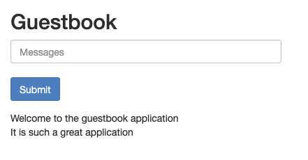

# guestbook

This is a sample kpt package that is based on the Kubernetes
[Deploying PHP Guestbook application with Redis](https://kubernetes.io/docs/tutorials/stateless-application/guestbook/)
example.

To change the namespace of all resources in the guesbook application. do the following

1. Change the `namespace` field on line 20 of the Kptfile to the namespace value you want to use, for example "my-lovely-namespace"
1. Change the `namespace` field on line 23 of the Kptfile to the namespace value you want to use, for example "my-lovely-namespace"

Execute the following command to run the mutation pipeline:

```
kpt fn render guestbook
```

Explanation of the mutation pipeline in the Kptfile:

1. The `create-setters` krm function at line 11 creates a `# kpt-set: ${namespace}` comment on the field `namespace: default` on all resources of kind Namespace in the kpt package. The `selectors` field restricts the krm function to resources of kind Namespace. There is only one Namespace in this kpt package, in the "namespace.yaml" file.

```
apiVersion: v1
kind: Namespace
metadata:
  name: default # kpt-set: ${namespace}
```

2. The `apply-setters` krm function at line 16 sets the field at the `# kpt-set: ${namespace}` comment on the field `namespace: default` on all resources of kind Namespace in the kpt package. The namespace is set to whatever you have used in the "namespace" field at line 20. The `selectors` field restricts the krm function to resources of kind Namespace. There is only one Namespace in this kpt package, in the "namespace.yaml" file. The namespace will be set to "my-lovely-namespace" if you have specified the the mutation as follows:

```
kptfile fragment:
    - image: ghcr.io/kptdev/krm-functions-catalog/apply-setters:v0.2
      selectors:
        - kind: Namespace
      configMap:
        namespace: my-lovely-namespace
```
namespace.yaml:
```
apiVersion: v1
kind: Namespace
metadata:
  name: my-lovely-namespace # kpt-set: ${namespace}
```

3. The `set-namespace` krm function at line 21 sets the namespace in all resources to "my-lovely-namespace", for example in "redis/redis-leader-service.yaml":

```
apiVersion: v1
kind: Service
metadata:
  name: redis-leader
  labels:
    app: redis
    role: leader
    tier: backend
  namespace: my-lovely-namespace
spec:
  ports:
  - port: 6379
    targetPort: 6379
  selector:
    app: redis
    role: leader
    tier: backend
```

To deploy, runthe following commands:
```
kpt live init guestbook
kpt live apply guestbook

kubectl get pods -n my-lovely-namespace
NAME                              READY   STATUS    RESTARTS   AGE
frontend-6b46678c94-mwcnm         1/1     Running   0          15s
frontend-6b46678c94-qkwrf         1/1     Running   0          15s
frontend-6b46678c94-vbfc7         1/1     Running   0          15s
redis-follower-66847965fb-gvx25   1/1     Running   0          15s
redis-follower-66847965fb-jfr8l   1/1     Running   0          15s
redis-leader-665d87459f-kn2kz     1/1     Running   0          15s

kubectl get services -n my-lovely-namespace
NAME             TYPE           CLUSTER-IP       EXTERNAL-IP      PORT(S)        AGE
frontend         LoadBalancer   10.197.98.39     172.18.255.201   80:31515/TCP   39s
redis-follower   ClusterIP      10.197.251.188   <none>           6379/TCP       39s
redis-leader     ClusterIP      10.197.32.165    <none>           6379/TCP       39s
```

To see the guestbook UI, point your browser at port 80 of the external IP address of the service, "http://172.18.255.201:80" in the example above.

