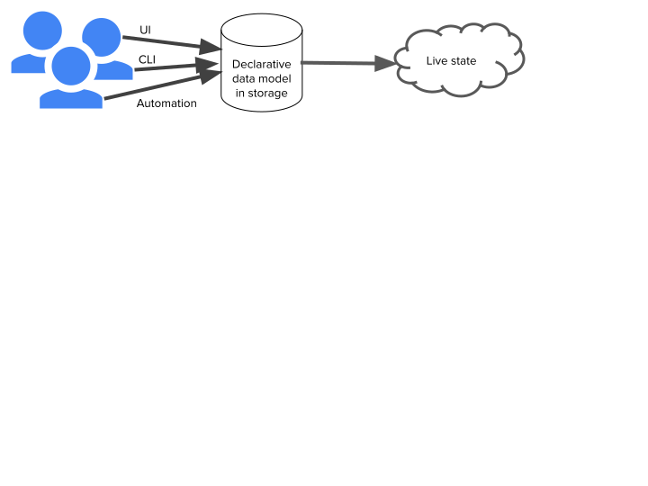

# The Rationale behind kpt

Infrastructure as Code (IaC) refers to two main ideas, which go hand in hand:
1. Represent infrastructure configuration as code or a code-like text format: general-purpose languages, domain-specific configuration languages, and template languages.
2. Use the same tools to manage infrastructure configuration as for managing software code: IDEs, version control, code review, and deployment tools.

Most Kubernetes users either manage their resources using conventional imperative graphical user interfaces, command-line tools (kubectl), and automation (e.g., Operators) that operate directly against Kubernetes APIs or IaC tools, such as Helm, Terraform, cdk8s, or one of the [dozens of other tools](https://docs.google.com/spreadsheets/d/1FCgqz1Ci7_VCz_wdh8vBitZ3giBtac_H8SBw4uxnrsE/edit#gid=0). 

The imperative and IaC paradigms are not interoperable because most IaC tools assume exclusive actuation, and other changes to the live state are considered to be undesirable configuration drift. One of the main features of GitOps tools is that their continuous reconciliation mechanisms detect and remediate drift.

Imperative tools are generally considered easier to use and adopt, but become toilsome to use at scale due to the lack of reusability and automation. On the other hand, Infrastructure as Code provides more power and control, but presumes human authoring and maintenance of complex configuration text representations, which has been described as artisanal automation due to the expertise and time required. Much of this effort is redundant, as the same patterns recur in every package in which the same resource types appear.

Additionally, Infrastructure as Code representations whose consumer interfaces to configuration packages consist of package parameters (e.g., [values.yaml](https://helm.sh/docs/chart_template_guide/values_files/) for Helm charts and [input variables](https://github.com/terraform-google-modules/terraform-google-kubernetes-engine#inputs) for Terraform modules) suffer from the problem of [excessive parameterization](https://github.com/kubernetes/design-proposals-archive/blob/main/architecture/declarative-application-management.md#parameterization-pitfalls). The inherent [tradeoff between flexibility and usability / simplicity](https://en.wikipedia.org/wiki/Flexibility%E2%80%93usability_tradeoff) drives off-the-shelf packages to degenerate into [struct constructors](https://docs.google.com/presentation/d/1w4fkDNcYjvxie4GRqYuoE1oLTybsZk1anLjirN1aVnc/edit?ts=5fc7e108&pli=1#slide=id.gaeddea60e5_1_173), as complex as the resource types they contain, but hiding their formal APIs.

Fortunately, Infrastructure as Code is not a requirement in order to represent the state declaratively. The Kubernetes API was [designed to be natively declarative](https://github.com/kubernetes/design-proposals-archive/blob/main/architecture/resource-management.md#declarative-configuration). The serialized configuration format of resources is [identical to their API wire format](https://github.com/kubernetes/design-proposals-archive/blob/main/architecture/declarative-application-management.md#configuration-using-rest-api-resource-specifications). These resource representations were intended to form the core of a declarative data model, which is sufficient in order to support pre-deployment validation, preview, and approval and post-deployment auditing, versioning, and undo. 

kpt supports management of Configuration as Data. The core ideas are simple:
* uses a uniform, serializable data model to represent configuration ([KRM](https://github.com/kubernetes/design-proposals-archive/blob/main/architecture/resource-management.md))
* makes configuration data (packages) the source of truth, stored separately from the live state 
* separates code that acts on the configuration (functions) from the configuration data
* abstracts the storage layer (using the [function I/O spec](https://github.com/kubernetes-sigs/kustomize/blob/master/cmd/config/docs/api-conventions/functions-spec.md)) so that clients manipulating configuration data don’t need to directly interact with it

kpt builds on our learnings from [Kustomize](https://kubernetes-sigs.github.io/kustomize/), but optimizes for in-place configuration transformation rather than out-of-place transformation, and also extends its capabilities in areas that are [out of scope](https://github.com/kubernetes/design-proposals-archive/blob/main/architecture/scope.md#examples-of-projects-and-areas-not-in-scope), notably packaging.

kpt currently provides a client-side CLI, but we plan to develop APIs to enable other clients to leverage its capabilities. It’s not just another package tool, but the kernel of a package orchestration service.

This enables WYSIWYG management of configuration similar to how the live state can be modified with traditional imperative tools:

